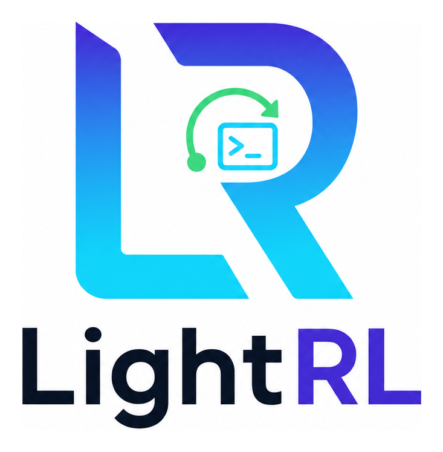

# LightRL

<div align="center">



**面向智能体环境的轻量、高效、可扩展强化学习后训练框架**

[](pyproject.toml)
[](https://www.python.org/downloads/)
[](https://pytorch.org/)
[](LICENSE)

[English](README.md) | 简体中文

</div>

## 项目概述

LightRL 是面向交互式环境中语言模型智能体的强化学习后训练框架。每个
实验都显式组合以下四个维度，便于审阅、复现与扩展：

| 维度 | 当前选项 | 代码入口 |
| --- | --- | --- |
| Harness | Camel-Agent、Claude Code CLI | `agentic_rl/harnesses/` |
| Environment | SETA、Agent-SafetyBench、AgentHarm、tau2、SWE-smith / SWE-verified | `agentic_rl/environments/` |
| Model | Qwen3-8B、Qwen3-30B-A3B、GLM-5.1 | `configs/rollout/` |
| Algorithm | GRPO / DAPO、DIVE-PO | Slime 后端与 `agentic_rl/algorithms/` |

LightRL 内置 Slime 与 Megatron-LM 训练后端。终端环境由 Docker worker
隔离执行，训练进程通过 HTTP 调用。worker 既可部署在独立的 CPU/Docker
主机，也可与 GPU 训练进程部署在同一主机；同机部署时应预留足够的 CPU、
内存、Docker 网络和端口资源。

## 目录

- [核心能力](#核心能力)
- [运行模型](#运行模型)
- [系统架构](#系统架构)
- [安装与前提](#安装与前提)
- [快速开始](#快速开始)
- [配置与输出](#配置与输出)
- [验证状态](#验证状态)
- [开发与扩展](#开发与扩展)
- [文档](#文档)
- [致谢](#致谢)
- [引用](#引用)
- [许可证](#许可证)

## 核心能力

- **配方驱动训练**——每个实验对应一个可审阅的 shell 脚本；启动前可用
  `--dry-run` 查看数据、模型、并行配置与完整后端命令。
- **多类智能体环境**——覆盖 SETA、Agent-SafetyBench、AgentHarm、tau2、
  SWE-smith / SWE-verified；终端任务通过 Docker worker 隔离执行。
- **明确的算法边界**——GRPO / DAPO 由内置 Slime 后端提供；LightRL 在
  `agentic_rl/algorithms/` 中维护 DIVE-PO 探索扩展和 PRM 奖励 agent。
- **低成本扩展**——环境、harness 与奖励后处理均有集中注册入口，新增能力
  无需在训练链路中散落修改条件分支。
- **完整可观测性**——逐轮对话轨迹、JSONL 指标、W&B 曲线、配置快照与数据
  清单统一写入 `runs/<RUN_ID>/`。
- **有界端到端验证**——4 GPU 小样本检查覆盖 rollout、奖励成形与 actor
  更新，无需完整训练即可验证部署链路。

## 运行模型

```text
训练配方
  → Slime 启动器：数据准备、worker 发现、命令组装
  → Rollout 钩子：harness + 推理 + 环境交互
  → 奖励成形：分数构造与可选 DIVE-PO 后处理
  → Actor 更新：通过 Slime / Megatron-LM 训练
```

终端任务需要一个可用 Docker 的 worker，并通过 `WORKER_URLS` 暴露服务。
worker 可以运行在独立 CPU/Docker 主机上，也可以运行在当前 GPU 训练主机
上；后者适合资源充足的单机部署，但需要避免 Docker 容器与训练进程争用
CPU、内存、磁盘和端口。单个 worker 默认由训练进程直连；配置多个 worker
或显式设置 `START_ENV_POOL_SERVER=1` 时，可启动本地 router 做租约路由。

## 系统架构

```text
examples/training/<recipe>.sh
  → agentic_rl/platform/slime_train.sh          # 稳定公开入口
      ├─ slime_train/lib_*.sh                    # 7 阶段：目录、配置、数据、worker、参数、启动
      └─ slime/train_async.py                    # GRPO / DAPO 训练后端
          → agentic_rl/rollout/entrypoint.generate
              ├─ environments/registry.py       # 数据源、运行模式与奖励策略注册
              ├─ harnesses/factory.py           # Camel-Agent / Claude Code 工厂
              ├─ rollout/backends/sglang.py     # 共享的 sglang 轮次客户端
              ├─ rollout/generate_steps.py      # 多轮交互、评分与探索奖励
              └─ rollout/sample_builder.py      # 奖励成形 → Sample.reward["score"]
          → algorithms/dive_po/rewards/dual_stream
                                                   # 可选组归一化奖励后处理
```

启动器内部依次加载 `lib_bootstrap`、`lib_run_dir`、`lib_rollout_cfg`、
`lib_dataset`、`lib_worker`、`lib_args` 与 `lib_launch`。训练配方只依赖稳定的
`slime_train.sh` 入口，第三方后端细节与项目新增逻辑保持分层。

### 仓库结构

```text
LightRL/
├── agentic_rl/
│   ├── algorithms/
│   │   ├── dive_po/         # DIVE-PO exploration、rewards 与默认参数
│   │   └── prm/             # PRM（process reward）奖励 agent
│   ├── data/                # 数据转换、下载与训练数据准备
│   ├── environments/        # EnvSpec 注册表、协议、runtime、奖励规则与 HTTP client
│   ├── evaluation/          # SWE-bench 等官方格式导出与评测适配
│   ├── harnesses/           # Camel-Agent / Claude Code harness 与统一工厂
│   ├── misc/                # rollout 日志与 JSONL sink
│   ├── platform/            # Slime 启动器、worker/router、路径与环境变量解析
│   └── rollout/             # 入口钩子、交互循环、推理后端、准入与轨迹存储
├── configs/rollout/         # rollout 模型模板（唯一保留的组合配置层）
├── examples/
│   ├── training/            # 正式训练 recipe 与 world_model/WIP 入口
│   └── validation/          # 不含站点拓扑的通用验证辅助文件
├── benchmarks/              # benchmark 数据与任务定义
├── deploy/workers/          # Docker worker 启动、预热、清理与恢复脚本
├── tools/                   # 分析、评测和开发诊断工具
├── tests/                   # pytest 单元与集成测试
├── slime/                   # 内置第三方 rollout/训练后端
├── Megatron-LM/             # 内置第三方模型训练后端
├── runs/                    # Git 忽略的运行配置、日志、指标与轨迹
└── docs/                    # 架构、算法、配置、评测与运维文档
```

## 安装与前提

- Python ≥ 3.10。
- 真实训练需要已准备 CUDA、Slime、Megatron-LM 和模型 checkpoint 的运行环境。
- SETA 等终端任务需要可用 Docker 的 worker；worker 可位于独立 CPU 主机，
  也可位于当前 GPU 训练主机。
- 训练进程必须能访问 worker 服务端口（默认 `18081`）；同机部署可使用
  `127.0.0.1`，跨主机部署应使用训练节点可达的地址。
- 站点地址、凭据和调度参数应放入环境变量或被 Git 忽略的
  `local/cluster/` 文件，不要提交到仓库。

源码安装 Python 包：

```bash
python3 -m pip install -e '.[rollout,worker,train]'
python3 -c 'import agentic_rl'
```

该命令只安装 Python 包及所选可选依赖，不会准备 CUDA、模型权重或集群运行
环境。真实训练仍需按 Slime 与 Megatron-LM 的要求准备后端依赖。

## 快速开始

### 1. 启动并配置 worker

先在选定的 Docker 主机上启动 worker。该主机可以是独立 CPU 节点，也可以是
当前 GPU 训练节点；完整启动参数、容量配置和运维脚本见
[Docker worker 文档](deploy/workers/README.md)。已完成机器准备时，可从仓库
根目录启动默认 pool server：

```bash
bash deploy/workers/run_pool_server_pu_v2.sh
```

然后在训练进程所在 shell 中配置服务地址并检查健康状态：

```bash
export WORKER_URLS=http://<WORKER_HOST>:18081
curl --noproxy '*' --fail http://<WORKER_HOST>:18081/healthz
```

同机部署时 `<WORKER_HOST>` 可设为 `127.0.0.1`；跨主机部署时填写 worker
的可达 IP 或主机名。多个 worker 使用逗号分隔的 `WORKER_URLS`，也可通过
`WORKER_URLS_FILE` 提供地址列表。

### 2. 检查训练配方

当前维护的主要入口如下；`examples/training/world_model/` 仍处于 WIP，不属于
稳定训练配方。

| Recipe | Harness | Model | Environment | Algorithm |
| --- | --- | --- | --- | --- |
| `train_qwen3_8b_seta_dapo.sh` | Camel-Agent | Qwen3-8B | SETA | DAPO |
| `train_qwen3_8b_seta_dive_po.sh` | Camel-Agent | Qwen3-8B | SETA | DIVE-PO |
| `train_qwen3_8b_mixed_dapo.sh` | Camel-Agent | Qwen3-8B | SETA + Agent-SafetyBench + AgentHarm | DAPO |
| `train_glm_5_1_seta_dapo.sh` | Camel-Agent | GLM-5.1 | SETA | DAPO |

先在 GPU 训练环境中执行 `--dry-run`，检查解析后的数据、模型、并行参数与
后端命令：

```bash
bash examples/training/train_qwen3_8b_seta_dapo.sh --dry-run
bash examples/training/train_qwen3_8b_seta_dive_po.sh --dry-run
bash examples/training/train_qwen3_8b_mixed_dapo.sh --dry-run
bash examples/training/train_glm_5_1_seta_dapo.sh --dry-run
```

### 3. 启动训练

```bash
WORKER_URLS=http://<WORKER_HOST>:18081 \
NUM_GPUS=4 ACTOR_GPUS=2 ROLLOUT_GPUS=2 TP_SIZE=2 \
ROLLOUT_NUM_GPUS_PER_ENGINE=2 \
bash examples/training/train_qwen3_8b_seta_dapo.sh
```

可用 `RUN_ID` 覆盖运行名；设置 `BACKGROUND=1` 时，启动器日志写入
`runs/<RUN_ID>/launcher.log`。GLM-5.1 配方还需要可用的 `HF_CKPT`、
`REF_LOAD` 与兼容的 `MODEL_ARGS_FILE`。更多入口与参数见
[训练示例](examples/README.md)。

### 4. 执行源码级检查

```bash
python3 -m compileall -q agentic_rl
python3 -m pytest tests/agentic_rl -q
WORKER_URLS=http://127.0.0.1:18081 \
  bash examples/training/train_qwen3_8b_seta_dapo.sh --dry-run
```

集群专用启动器和 smoke wrapper 保留在被忽略的本地配置中，因为其中包含
站点拓扑和路径信息。

## 配置与输出

### 训练配置

训练默认配置直接写在 recipe 脚本中。Python 侧环境变量解析集中于
`agentic_rl/env.py`，其中的 `ENV_VARS` 表记录 rollout 相关变量。
环境与数据源能力集中在 `agentic_rl/environments/registry.py` 的 `EnvSpec`
表中，模型侧 rollout 模板集中在 `configs/rollout/`。环境变量可覆盖 recipe
默认值；完整字段、优先级和示例见[配置说明](docs/configuration.md)。

站点专用地址、凭据、代理和调度容量不得写入公共 recipe，应通过环境变量或
被 Git 忽略的 `local/cluster/` 提供。

### 输出目录

每次运行写入 `runs/<RUN_ID>/`：

```text
runs/<RUN_ID>/
├── config/                # 解析后的配置快照与数据集清单
├── environment_outputs/   # 环境侧 AgentRunner 输出
├── logs/                  # train.log、metrics.jsonl 与启动日志
├── trajectories/          # 单样本 traj.json 与旁路索引 index.jsonl
└── metrics/               # W&B 与离线分析产物
```

`runs/latest` 指向最近一次运行。训练产物应进入 `runs/`，不应在仓库根目录
散落临时文件。checkpoint 与 W&B 的存储约定见
[Checkpoint 与 W&B 存储](docs/operations/checkpoint-wandb.md)。

## 验证状态

最近一次有界验证（2026-08-07，4 GPU，P0–P2 重构后）结果如下：

- SETA + DAPO：3 个 rollout、6 个 actor train step，更新值有限且非零，
  验证标记为 `TRAINING_METRICS_OK`。
- SETA + DIVE-PO：3 个 rollout、7 个 actor step、4 个非零更新，并完整导出
  轨迹产物，验证标记为 `EXAMPLE_VALIDATION_OK`。
- Mixed（SETA + Agent-SafetyBench + AgentHarm）+ DAPO：8 条指标记录、4 个
  actor train step、4 个非零更新，验证标记为 `EXAMPLE_VALIDATION_OK`。

以上是短程正确性检查，不代表模型收敛或正式 benchmark 成绩。

## 开发与扩展

常用源码级检查：

```bash
python3 -m pytest tests/ -q
python3 -m compileall -q agentic_rl
```

- **新增环境**——在 `agentic_rl/environments/registry.py` 注册一条
  `EnvSpec`，并实现 `environments/protocol.py:EnvClient` 协议；本地/远程
  运行、评分模式、安全奖励模式与轨迹别名均由注册表集中决定。
- **新增 harness**——在 `agentic_rl/harnesses/factory.py` 的
  `_HARNESS_ALIASES` / `_HARNESS_TARGETS` 中注册，并实现
  `rollout/runner.py:RolloutAgent` 协议；可选依赖通过惰性 import 隔离。
- **新增奖励后处理**——暴露 `post_process_rewards(args, samples)`，并将
  `CUSTOM_REWARD_POST_PROCESS_PATH` 指向其 import 路径。
- **新增训练配方**——优先复用 `examples/training/` 中的稳定启动入口与
  `configs/rollout/` 模型模板，站点路径和凭据继续留在本地配置中。

## 文档

- [架构说明](docs/architecture.md)——包边界、训练链路、router 与注册表设计
- [配置说明](docs/configuration.md)——recipe、环境变量与覆盖优先级
- [DIVE-PO 奖励数学](docs/algorithms/dive_po_dual_stream.md)——双流优势与奖励后处理
- [Harness 选择](docs/harnesses/README.md)——Camel-Agent / Claude Code 接入
- [评测工具](docs/evaluation/README.md)——SWE-bench 等评测与格式导出
- [Docker worker](deploy/workers/README.md)——启动、容量、预热、清理与恢复
- [Checkpoint 与 W&B 存储](docs/operations/checkpoint-wandb.md)
- [训练示例](examples/README.md)——稳定配方、参数与验证入口

## 致谢

LightRL 内置 [Slime](https://github.com/THUDM/slime) 作为 rollout/训练运行时，
并使用 [Megatron-LM](https://github.com/NVIDIA/Megatron-LM) 进行模型训练。
智能体 RL 技术栈最初在 **OpenClaw-RL** 中研发，后抽取并重构为本框架。

## 引用

如果 LightRL 对您的工作有帮助，请引用：

```bibtex
@misc{lightrl,
  title={LightRL: A Lightweight, Efficient, Scalable RL Post-training Framework for Agentic Environments},
  author={Pu, Yuan and Zhang, Shaoang and Zhang, Chenhao and Li, Xueyan and Lu, Yudong and Tang, Jia and Wang, Guanchu and Niu, Yazhe},
  publisher={GitHub},
  howpublished={\url{https://github.com/opendilab/LightRL}},
  year={2026},
}
```

## 许可证

[MIT](LICENSE)
