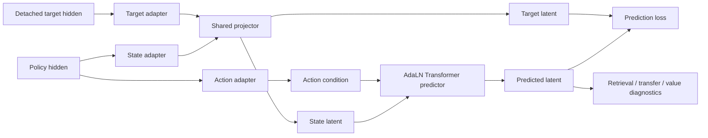
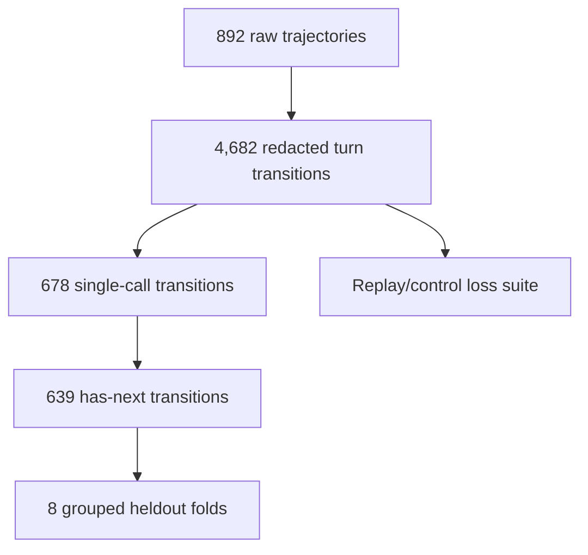
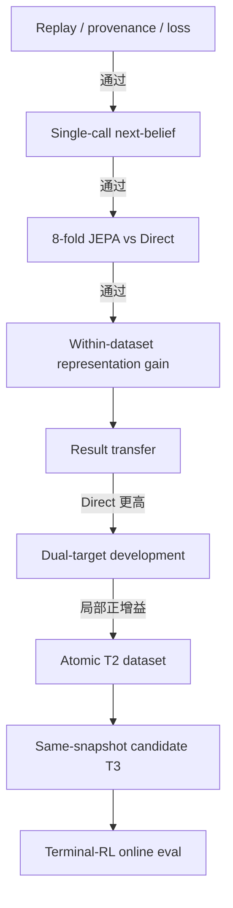

# JEPA Latent World Model 阶段进展

> 更新时间：2026-08-13<br>
> 代码分支：`jepa_wm`<br>
> LightRL 基线：`5b0a312b`<br>
> 适用范围：LightRL 中的 SETA / terminal-agent offline trajectory

## 1. 摘要

本项目研究一个面向 agentic RL 的 text latent world model：从 policy LLM hidden
中提取当前状态与 action 表征，经受控 projector 对齐到 shared latent space，再预测
执行后的 feedback 或 next belief。模型采用 JEPA joint-embedding objective，action
通过 AdaLN 调制 predictor。训练数据来自本地 trajectory 或独立 replay buffer，默认
不改动 policy loss、reward、advantage 和环境执行。

当前完成的核心验证如下：

| 问题 | 当前结果 | 结论范围 |
| --- | --- | --- |
| Offline replay 能否稳定重建并训练 | 4,682 条 transition，replay/control 数值一致，heldout loss 明显下降 | 工程闭环通过 |
| JEPA latent 能否预测 next belief | grouped 8-fold：JEPA MRR `0.31502`，Direct `0.20508`，增益 `+0.10994` | 当前 SETA 数据内成立 |
| 增益是否跨 fold 稳定 | `8/8` folds 为正，CI95 `[0.07907, 0.14411]`，`p=0.00390625` | 当前数据内稳定 |
| latent 是否直接提高 result prediction | JEPA `0.12464`，Direct `0.26516`，差值 `-0.14052` | 未得到支持 |
| dual-target 是否改善 result retrieval | 相对 next-only，两个 seed 的 observational result-transfer MRR 分别提高 `+0.04924/+0.08658` | 当前 task-heldout split 的开发结论；仍低于 Direct |
| tool choice 是否稳定受益 | 8-fold macro-F1 差值 CI95 跨 0 | 未得到支持 |
| 是否可以进入 online RL | atomic execution label、same-snapshot alternatives、独立 task cluster 仍缺失 | 尚未开放 |

现阶段可以支持一项明确结论：**在当前 SETA single-call 数据内，锁定配置的 JEPA
latent pathway 相对 parameter-matched raw-hidden Direct predictor，稳定提高 grouped
out-of-fold next-state retrieval。**

## 2. 研究目标

### 2.1 输入与目标

每条 turn transition 表示为：

\[
\tau_t=(h_t,a_t,o_{t+1},h_{t+1},r_t,d_t),
\]

其中：

| 符号 | 数据字段 | 含义 |
| --- | --- | --- |
| \(h_t\) | `context_messages` | action 生成前的 agent belief |
| \(a_t\) | `tool_call_bundle_v1` | assistant 输出与结构化 tool call |
| \(o_{t+1}\) | `result_only_v1` | immediate tool result 或 terminal feedback |
| \(h_{t+1}\) | next `context_messages` | 环境反馈进入上下文后的 next belief |
| \(r_t\) | reward contract | 可选 value / execution diagnostic label |
| \(d_t\) | `done` | trajectory 是否结束 |

项目最终目标包含三层：

1. **T1 Tool-use prediction**：从 latent 判断 tool class 或 action family。
2. **T2 Execution result prediction**：预测 verified atomic execution status、error type、exit code 或 result latent。
3. **T3 Candidate selection**：在同一 state 下对多个候选 action 预测后果，并用真实执行结果评估 top-1、success、regret 和 latency。

当前结果主要覆盖 next-belief representation learning。T1 有诊断指标，T2/T3 仍受数据合同限制。

## 3. 方法

### 3.1 从 LLM hidden 到 belief latent

HF policy encoder 对 `h_t + a_t` 做一次 causal forward：

```text
prompt tokens                         action tokens
      |                                     |
hidden at prompt end                 pooled action span
      |                                     |
state adapter                         action adapter
      |                                     |
shared projector C                    action projector
      |                                     |
z_state -----------------------> AdaLN predictor <--- z_action
                                          |
                                          v
                                  predicted target latent
```

state hidden 位于 action token 之前，因此 causal mask 保证该位置不读取当前 action。
action hidden 使用 action span 的 mean 或 last pooling。feedback 与 next-state target
通过 detached target forward 得到。

`belief_view_v1` 对 state 内容做受控选择，保留 task instruction、最近 observation、
tool result 与状态字段，限制完整历史中的格式和文本复制信号。

### 3.2 JEPA predictor



AdaLN predictor 只对 state token 做 causal self-attention。action latent 生成每层的
shift、scale 与 residual gate。`predictor_type=mlp` 保留为架构对照。

主要 objective：

\[
L=L_{pred}+\lambda_{sig}L_{SIGReg}+\lambda_{cf}L_{contrast}
+\lambda_{fb}L_{feedback}+\lambda_vL_{value}.
\]

- `L_pred`：feedback latent 或 next-belief latent prediction。
- `L_SIGReg`：约束 latent 的方差与各向同性。
- `L_contrast`：真实 action 相对 shuffled action 的 margin。
- `L_feedback`：dual-target 配置中的 observed result auxiliary objective。
- `L_value`：仅在 label contract 可验证时用于 value diagnostic。

### 3.3 对照组

| 对照 | 控制变量 |
| --- | --- |
| untrained JEPA | 检查增益是否来自训练 |
| state-only | 量化 state continuity |
| action-only | 量化 action marginal prior |
| shuffled action | 检查 action 配对信息 |
| concat MLP | 检查 AdaLN 架构贡献 |
| parameter-matched Direct | 检查 shared latent/JEP objective 的贡献 |

## 4. PR 历史与 LightRL 迁移

### 4.1 历史 PR

| 版本 | 主要内容 | 后续处理 |
| --- | --- | --- |
| [OpenClaw-RL PR #19](https://github.com/puyuan1996/OpenClaw-RL/pull/19) | default-off JEPA probe、strict eval、provenance、credential redaction、fail-closed HF 与 candidate gate | 作为安全与评测基线 |
| [OpenClaw-RL PR #21](https://github.com/puyuan1996/OpenClaw-RL/pull/21) | SETA hidden encoder、trajectory replay、dataset adapter、`train_latent.py` 与 terminal analysis | 作为 replay/offline trainer 基线 |
| 本地集成至 `8e910ea6` 及后续实验增量 | belief/action/result view、next-state objective、Direct baseline、result transfer、LoRA/fixed target、queue、best checkpoint、collapse diagnostics | 本次迁移的主要增量 |

PR #19 与 PR #21 的历史开发线不完全一致。本地集成分支以 `d54c9345` 为 hardened
基线迁入 `39981adc` 的功能，并保留 strict eval、provenance、redaction 和 fail-closed
约束。本次 LightRL 迁移继续使用该集成版本。

### 4.2 LightRL 适配范围

LightRL `main` 已包含早期 `slime.world_model` 和 `tools/world_model` 目录。本次适配
补齐以下内容：

- `world_model` 数据、模型、训练、严格评测与 Direct 对照模块；
- `agentic_rl/algorithms/lwm` 的 rollout collection 与 replay 公共接口；
- AgenticRL rollout 的 default-off metadata 接口；
- Slime `RolloutDataSourceWithBuffer` 的独立 world-model replay；
- `tools/world_model/run_world_model_seta_latent.sh` 通用入口与
  `examples/training/world_model` 示例脚本；
- 一组覆盖 default-off、redaction、replay provenance 与 JEPA forward 的公共合同测试；
- LightRL 路径、文档导航和历史 artifact compatibility。

历史 schema 继续使用 `openclaw_*` 名称，以便直接读取已有 trajectory、cache、replay
和 checkpoint。新项目路径与 Python package 使用 LightRL 当前布局。

以下内容未进入迁移提交：

- 集群地址、模型绝对路径和 trajectory 绝对路径；
- 2026-07 至 2026-08 的机器专用 4/8-GPU launcher；
- `runs/`、hidden cache、checkpoint、PDF/PPT 和中间日志；
- 未完成的 online auxiliary policy-loss 接线。

### 4.3 迁移验证

| 检查 | 结果 |
| --- | --- |
| LightRL 原有兼容测试 + LWM 公共合同测试 | `33 passed` |
| `test_loss_hook.py` | 开发机缺少 `ray`，未收集；文件与实现均保持 LightRL 基线 |
| 通用训练脚本 | 32 条 transition 的 hash smoke 完成 |
| 产物 | records、hidden cache、checkpoint、predictions、summary 均生成 |
| 静态检查 | `py_compile`、`bash -n`、`git diff --check` 通过 |
| rollout replay runtime | 开发机环境缺少 `ray`，待完整 LightRL 训练镜像验证 |

## 5. 数据审计

### 5.1 当前 offline 数据



| 数据层 | 数量 | 用途 |
| --- | ---: | --- |
| raw SETA trajectory | `892` | 原始离线数据 |
| rebuilt transition | `4,682` | replay/loss 与 full-data 诊断 |
| single-call transition | `678` | 降低 multi-call action/result 对齐歧义 |
| single-call `has_next=true` | `639` | next-belief 主实验 |
| 8-fold heldout | 每 fold `79-80` | grouped out-of-fold 评测 |

### 5.2 已具备的数据合同

- turn-level context、action、tool result、next context；
- redaction 与 canonical hash；
- transition ID、source path、records/cache/checkpoint digest；
- `task_id` group-disjoint split；
- replay capacity、eviction、RNG state 和 load/save 校验。

### 5.3 缺失的数据合同

| 缺失项 | 影响 |
| --- | --- |
| verified atomic `status/error_type/exit_code` | 完整 T2 rows 实测为 `0`，strict T2 accuracy 无法计算 |
| `task_cluster_id` 与独立 test | task-cluster labels 实测为 `0`，external generalization 无法确认 |
| same-snapshot alternative actions | branched T3 rows 与 candidate sets 实测均为 `0`，counterfactual T3 无法确认 |
| verified execution reward | verified execution rewards 实测为 `0`，value head 只能作为诊断 |
| frozen environment snapshot / restorable worker | online reranking 的执行公平性不足 |

## 6. 实验结果

### 6.1 实验时间线

下表覆盖 OpenClaw-RL 历史 PR、offline replay 重建以及后续 next-belief、result-transfer
和 anti-collapse 实验。单次开发结果与 confirmatory 结果分开记录。

| 阶段 | 数据与设置 | 结果 | 结论 |
| --- | --- | --- | --- |
| 早期 Stage-A / P2 | full `2,878`、clean `472`、tool-only `2,591`；observational candidate set | WM-random 差值 `+0.3058`；heldout mean/min `0.2908/0.2826` | 验证评测管线可运行；candidate 来自观测数据且缺少 same-snapshot，未作为 confirmatory 证据 |
| Replay 重建 | `892` trajectories，`4,682` transitions，task-disjoint `3,736/946` | replay 与 no-replay loss 完全一致；三 seed final val loss `0.45085 ± 0.00863` | replay persistence 和 offline trainer 闭环通过 |
| Feedback 2×2 factorial | MLP/AdaLN × contrast on/off | 最佳 feedback retrieval MRR `0.1265`；shuffled top-1 `0.00106`；tool accuracy `0.7472`，majority `0.7442`；macro-F1 `0.5420`，raw Qwen `0.6277` | feedback retrieval 有训练信号；tool 增益很小，MLP 高于 AdaLN |
| Full-context next-state | `4,682` records，完整 next context | predicted MRR 约 `0.00786`，state identity `0.102`，raw Qwen `0.212`；alignment 接近正交基线 `0.015625` | feedback-to-next-context bridge objective 未形成有效 next-state geometry |
| `belief_view_v1` L0 | 四 seed，受控 state view | mean loss `1.1622→0.4348`；predicted `0.1371`，identity `0.1506`，shuffle `0.1126`；gate `0/4` | 存在 action signal，状态连续性仍是主要 shortcut |
| N1b input ablation | observed/state-only/action-only | MRR `0.1350/0.1378/0.0420`，identity `0.1518` | state-only 略高于 observed；seed 11 失败后未扩展 seed |
| Strongest baseline / residual | raw Direct 与 JEPA residual | Direct observed/state-only/zero `0.0493/0.0492/0.0495`；residual `0.1530`，identity `0.1615`；相对 learned state-only `+0.0152` | residual 保留 action signal，预注册 `0.02` margin 未通过 |
| Full result-only falsification | 全量 observational result target | JEPA observed/action-only/MLP/Direct `0.1324/0.1597/0.1609/0.0755`；rank retention `0.349/0.426` | action prior、multi-call 对齐和 prediction rank contraction 同时存在 |
| Fixed-target hierarchical | `result_only_v1`，grouped heldout | JEPA observed MRR `0.03084`；Direct `0.08272`；action-only `0.04522` | fixed target 缓解 target 漂移；observed JEPA 未超过 Direct 或 action prior |
| Pred-SIGReg | 对 predicted latent 增加 SIGReg | observed `0.05542`，shuffle `0.04349`，action-only/MLP/Direct `0.06389/0.08209/0.08272`；effective-rank/variance retention `1.116/5.318` | collapse 修复；预注册 shuffle margin `0.02` 未通过 |
| Action fusion | direct/residual × contrast；winner `direct,c=0.2` | observed `0.09196`，shuffle `0.04823`，action-only/MLP/Direct/Direct-action `0.10168/0.11033/0.09654/0.11883` | action sensitivity 提高；contrast 相对 no-contrast 仅 `+0.00078`，完整 gate 未通过 |
| Full-step / complete-goal | 四 arm 与 anti-collapse screen | full-step 各 arm effective-rank 均退化；complete-goal 修复 collapse，仍未达到 shuffle `+0.02` | geometry 修复未转化为稳定 retrieval 或 tool gain |
| Single-call feedback | `678` single-call records | observed MRR `0.24563`，shuffle `0.21158`，action-only `0.32628`，Direct `0.18726` | 降低 action/result 对齐歧义后检索改善；action prior 仍占主导 |
| Single-call next-belief | `639` has-next records，seed 11 | JEPA `0.26031`，Direct `0.16009`，state-only `0.26216`，shuffle `0.24534` | JEPA 相对 Direct 有增益；action-conditioned 证据不足 |
| Grouped 8-fold | 锁定配置，互斥 task folds | JEPA `0.31502`，Direct `0.20508`，`8/8` 为正，CI95 `[0.07907,0.14411]` | 当前最强 confirmatory 结果：JEPA next-belief representation gain 成立 |
| Result transfer | 每 fold 只用 train indices 拟合低容量 head | JEPA `0.12464`，Direct `0.26516`，差值 `-0.14052` | next-belief latent 未带来 observed result prediction 增益 |
| Dual-target LoRA | next-state + `0.3 × feedback`，两 seed | result MRR 相对 next-only `+0.06791`；next-state MRR `-0.07200`；仍低于 Direct | auxiliary feedback 提供局部增益，同时存在目标权衡和 collapse |
| Queue / best checkpoint | cross-microbatch queue，paired configured/unconfigured | seed 11 result MRR `0.09105/0.07116`；next-state `-0.04457`；seed 13 提前停止 | 单 seed configured gain 为正；完整 paired gate 未形成 |
| Recovery anti-collapse | seed 11/13，configured/unconfigured | 尚无 `aggregate_summary.json` 或 `done.txt` | 当前无可报告研究结论 |

工程运行记录与模型结果分开统计。L0 首次启动因 Bash 变量展开终止；result-only
provenance gate 曾发现 compact JSON 二次 redaction；hierarchical 首次启动时 regex
redaction 破坏转义 JSON，随后改为结构化解析。两轮 GPU utilization 失败分别来自错峰
启动窗口和 CPU cache serialization 被计入 critical phase。8 月 7 日 full pipeline 在训练前
因 CPU checkpoint tensor 与 CUDA state 比较触发 device mismatch。Python 路径、缓存前置
条件和子进程 barrier 导致的 launcher 失败均不计入模型结果。

### 6.2 Replay 与 offline loss

4,682 条 transition 按 `task_id` 拆分为 `3,736/946` train/validation。三 seed 的
replay AdaLN 结果如下：

| seed | initial val loss | final val loss | 相对下降 |
| ---: | ---: | ---: | ---: |
| 11 | `0.85123` | `0.44583` | `47.63%` |
| 13 | `0.84596` | `0.44592` | `47.29%` |
| 17 | `0.84358` | `0.46082` | `45.37%` |

三 seed final validation loss 为 `0.45085 ± 0.00863`。相同 seed、相同 transition
顺序下，replay 与 no-replay 的 best/final loss 差值均为 `0.0`，并且无 eviction。
该结果确认 replay persistence 未改变训练数据。

### 6.3 Full-data next-state 诊断

早期 4,682-record next-state 评测中，AdaLN predicted MRR 约 `0.00786`，raw-state
MRR 约 `0.21200`。loss 收敛没有转化为可用 retrieval。该结果推动了三项修改：

1. 使用 `belief_view_v1` 控制 target 内容；
2. 筛选 action/result 对齐清楚的 single-call transition；
3. 将 Direct、state-only、action-only 和 shuffled action 设为固定对照。

### 6.4 Single-call next-belief screen

639 条 `has_next=true` transition 的 seed-11 screen：

| 模型 | MRR |
| --- | ---: |
| observed JEPA | `0.26031` |
| state-only JEPA | `0.26216` |
| MLP observed | `0.25093` |
| parameter-matched Direct | `0.16009` |
| shuffled action | `0.24534` |
| zero action | `0.19760` |

JEPA 相对 Direct 增益为 `+0.10021`。observed 与 state-only 接近，shuffled-action
增益为 `+0.01497`，因此单 seed 结果还不能确认稳定的 action-conditioned dynamics。

### 6.5 Grouped 8-fold JEPA representation gain

锁定 `belief_view_v1 + AdaLN direct + frozen_random_orthogonal_v1 + SIGReg=0.03`，
在 8 个互斥 `task_id` folds 上评测：

| 指标 | JEPA | Direct / 对照 | 差值 |
| --- | ---: | ---: | ---: |
| next-state MRR mean | `0.31502` | Direct `0.20508` | `+0.10994` |
| trained MRR mean | `0.31502` | untrained `0.05727` | `+0.25774` |
| state-conditioned MRR | `0.31502` | state-only `0.28348` | `+0.03154` |
| architecture MRR | `0.31502` | MLP `0.30769` | `+0.00733` |
| tool macro-F1 | `0.53513` | raw hidden `0.52504` | `+0.01010` |

统计结果：

- JEPA 相对 Direct：`8/8` folds 为正；
- fold bootstrap CI95：`[0.07907, 0.14411]`；
- exact one-sided sign-flip：`p=0.00390625`；
- 每 fold validation loss 下降 `53.04%-57.05%`；
- Direct/JEPA 参数比 `1.000033`；
- relative collapse gate：`8/8` 通过。

该实验完成当前最重要的阶段目标：JEPA latent 对 next-belief retrieval 具有稳定增益。
AdaLN 相对 MLP 的差值较小，tool macro-F1 的 CI95 跨 0，这两项仍为诊断结果。

### 6.6 Observational result transfer

每 fold 只使用 source checkpoint 的 train indices 拟合低容量 result head，并在对应
heldout fold 评测：

| 模型 | result MRR mean |
| --- | ---: |
| JEPA predicted latent | `0.12464` |
| parameter-matched Direct | `0.26516` |
| MLP | `0.16407` |
| state-only | `0.10888` |
| untrained | `0.09789` |

JEPA 相对 Direct 为 `-0.14052`，`0/8` folds 为正，CI95
`[-0.17340, -0.10510]`。result head validation loss 在 `8/8` folds 下降，训练链路
有效；当前 next-belief geometry 对 observed result 的区分信息不足。

### 6.7 Dual-target LoRA

在 next-state objective 上增加 `0.3 * feedback_aux_loss`，Qwen3-8B student 使用
LoRA，target backbone 冻结。两个 seed 的 6 小时训练均完成：

| 指标 | dual observed | next-only | 差值 |
| --- | ---: | ---: | ---: |
| result-transfer MRR mean | `0.13056` | `0.06265` | `+0.06791` |
| next-state MRR mean | `0.10192` | `0.17392` | `-0.07200` |
| result MRR vs Direct | `0.13056` | Direct `0.18528` | `-0.05472` |

两个 seed 的 configured result gain 分别为 `+0.04924/+0.08658`。现有证据支持
feedback auxiliary objective 改善当前 split 上的 observational result retrieval。
该配置仍低于 Direct，同时出现 next-state regression、低 predicted-latent variance
retention 和早期最佳 validation epoch。latent 的 result 表征机制与跨数据稳定性仍需验证。

### 6.8 Queue 与 best-checkpoint 修订

6 小时实验使用 `batch_size=1`，SIGReg 和 batch 内 action shuffle 缺少有效样本。
后续实现加入 detached cross-microbatch queue 和 `best_validation` checkpoint。

上一轮 8 小时 paired run 中，seed 11 configured/unconfigured result MRR 为
`0.09105/0.07116`，差值 `+0.01989`；next-state MRR 变化 `-0.04457`。seed 13
configured arm 在约 `5.45` 小时停止，原因未查明，完整 paired gate 未形成。
三个已完成 arm 的 predicted-latent variance retention 为约 `0.09-0.10`，collapse
诊断未通过。

### 6.9 Recovery anti-collapse 实验（无聚合结果）

2026-08-13 启动了新一轮 4-GPU paired recovery 实验。文档复核时仍未发现
`aggregate_summary.json` 或 `done.txt`，以下四个 arm 没有可用聚合结果：

| seed | configured | unconfigured |
| --- | --- | --- |
| 11 | `sigreg300`，状态记录未完成 | 对照，状态记录未完成 |
| 13 | `exact`，状态记录未完成 | 对照，状态记录未完成 |

本轮实验不计入阶段结论。停止原因未查明。

## 7. 证据状态



### 7.1 已支持

- 本地 trajectory 可重建为 redacted、可追踪的 turn transition；
- replay round-trip 与 no-replay 控制数值一致；
- shared projector 与 JEPA predictor 可训练，并在 heldout 上降低 loss；
- 锁定 JEPA 配置在当前数据的 8-fold next-belief retrieval 中稳定超过 Direct；
- dual-target 配置在两个 development seed 上提高 observational result-transfer。

### 7.2 尚未支持

- AdaLN predictor 相对 parameter-matched MLP 的稳定增益；
- tool-choice macro-F1 的稳定提升；
- JEPA next-belief latent 相对 Direct 的 result prediction 增益；
- verified atomic execution-result accuracy；
- counterfactual candidate ranking；
- terminal-RL policy return、success rate 或 sample-efficiency 增益；
- 独立任务分布上的外部泛化。

## 8. 后续计划

### P0：完成 LightRL 迁移验证

1. 在完整 LightRL 训练镜像验证 AgenticRL rollout 开关关闭时 sample 与 loss 路径不变。
2. 开启 metadata/replay 开关，确认 `world_model_replay_<rollout_id>.pt` 可以恢复。
3. 在 GPU 环境复用 Qwen3-8B 做一组 frozen hidden next-belief smoke。

### P1：修复 latent geometry

1. 固定 8-fold split，比较 `SIGReg=0.03/0.10/0.30`。
2. 使用 cross-microbatch queue，记录 action-negative count 与 SIGReg sample count。
3. 使用 `best_validation` 导出，报告 final/best 差值。
4. 约束 result gain 与 next-state regression，避免单目标改善掩盖另一目标退化。

### P2：构建 atomic execution dataset

每个 tool call 单独记录：

```text
state_id, action_id, tool_name, normalized_args,
status, exit_code, error_type, result_hash,
environment_snapshot_id, task_cluster_id
```

先输出 coverage、class balance、group split 与 provenance audit。verified label 覆盖不足时，
保留 result-text retrieval 诊断，不报告 execution accuracy。

### P3：Terminal-RL 闭环

在同一 environment snapshot 下生成或执行多个候选 action，比较：

- raw policy score；
- Direct predictor；
- JEPA predictor；
- JEPA + value/result head；
- oracle executed outcome。

主指标为 top-1 execution accuracy、success、regret、额外 latency 和 policy return。
offline confirmatory gate、atomic T2 coverage 与 same-snapshot protocol 同时通过后再进入该阶段。

## 9. 复现入口

通用 offline 入口：

```bash
WM_TRAJECTORIES=/path/to/trajectories \
WM_OUTPUT_DIR=runs/world_model/qwen_next_belief \
WM_ENCODER=hf-policy \
WM_HF_MODEL=/path/to/Qwen3-8B \
WM_STATE_VIEW=belief_view_v1 \
WM_PREDICTION_TARGET=next_state \
WM_SPLIT_GROUP_KEY=task_id \
bash examples/training/world_model/train_seta_next_belief.sh
```

rollout replay 收集：

```bash
WORKER_URLS=http://worker:18081 \
WM_REPLAY_BUFFER_SIZE=4096 \
bash examples/training/world_model/collect_seta_replay.sh
```

关键输出：

| 文件 | 内容 |
| --- | --- |
| `records.jsonl` | 实际训练使用的 redacted transitions |
| `hidden_cache.pt` | hidden tensor、mask、encoder fingerprint、records digest |
| `latent_world_model.pt` | model、split、optimizer step、cache provenance |
| `predictions.jsonl` | per-transition prediction diagnostic |
| `run_summary.json` | loss history、retrieval、collapse 与 claim boundary |

## 10. 汇报结论

项目已经完成 replay、数据对齐、shared latent、JEPA predictor、严格 offline eval 与
Direct baseline 的完整工程路径。8-fold 实验提供了当前数据内的 next-belief
representation gain 证据。result prediction、tool selection 和 online terminal-RL
增益仍需 atomic execution dataset 与 same-snapshot candidate protocol。下一阶段的
重点是数据合同与下游验证，同时保留当前 8-fold 配置作为固定 representation baseline。
