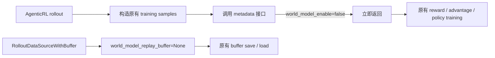
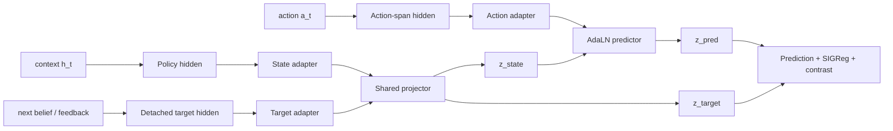

# JEPA Latent World Model 项目状态

> 更新时间：2026-08-14<br>
> 当前代码：LightRL `jepa_wm` / PR #2<br>
> 研究范围：SETA terminal-agent offline trajectory

## 1. 当前判断

### 1.1 LightRL 适配后的基本功能

当前实现具备以下能力：

- 从原始 SETA trajectory、records JSONL 或 verified replay 读取 turn transition；
- 从 policy LLM 提取 state、action、feedback 和 next-state hidden；
- 通过 adapter 与 shared projector 构造统一 latent space；
- 训练 action-conditioned JEPA predictor 和 parameter-matched Direct 对照；
- 输出 records、hidden cache、checkpoint、prediction 与诊断 summary；
- 在 AgenticRL rollout 中按需收集经过 redaction 的 metadata 和独立 replay。

现有验证包括 `33 passed`、32 条真实 SETA transition 的 hash smoke，以及完整 artifact
导出。历史 Qwen3-8B offline 实验已经覆盖 4,682 条 transition 和多组 GPU 训练，因此
offline LWM 基本功能已经得到实际数据验证。

### 1.2 对原训练流程的影响

所有 LWM 开关默认关闭。关闭时的运行路径如下：



关闭状态仍会发生三项轻量操作：

1. import `agentic_rl.algorithms.lwm.collection`；
2. 每次完成 rollout 后调用一次 metadata 接口，函数在检查开关后立即返回；
3. data source 初始化 `world_model_replay_buffer=None`，`save/load` 先执行原方法，再返回。

关闭状态不会构造 world model、不会编码 hidden、不会创建 replay、不会修改 reward、
advantage、policy loss、optimizer 或环境执行。当前没有发现改变 GRPO/DAPO 数值语义的路径。

| 代码位置 | 约束 |
| --- | --- |
| `slime/slime/utils/arguments.py` | `world_model_enable` 与 replay 开关默认均为 `False` |
| `slime/slime/world_model/metadata.py` | 开关关闭时 metadata 接口立即返回 |
| `slime/slime/ray/rollout.py` | 仅在 replay 开关打开时调用 collection adapter |
| `slime/slime/rollout/data_source.py` | 仅在 replay 开关打开时构造、保存和恢复 LWM replay |
| `slime/slime/world_model/loss_hook.py` | 当前 LightRL backend 没有生产调用点，online auxiliary loss 未接入 |

### 1.3 是否需要短程 `train-step`

需要补充一组短程运行时验证，目的在于确认 LightRL 的 Ray、rollout、checkpoint 和分布式
训练集成。该验证不承担研究效果评估，offline 效果已经由历史实验覆盖。

| 验证层级 | 建议设置 | 可以确认的内容 | 当前状态 |
| --- | --- | --- | --- |
| 代码级 | 单元测试 + hash smoke | 数据、模型、replay 与 artifact 闭环 | 已完成 |
| 合并前运行时 | 同一配置运行 2-3 个 train-step：default-off；metadata+replay | 原流程可训练；开关打开后 replay 可保存和恢复 | 建议补充 |
| 研究级 | grouped heldout、多 seed、Direct/MLP/state-only/shuffle 对照 | latent representation gain | 已完成当前数据内验证 |
| 应用级 | atomic labels、same-snapshot candidates、Terminal-RL online eval | tool/result accuracy 与 policy gain | 尚未完成 |

合并前建议执行两个短程 arm：

- `default-off`：保持现有训练命令，只运行 2-3 个 optimizer step；检查 loss、reward、sample
  数量、checkpoint 和异常日志。
- `metadata+replay`：仅增加 `--world-model-enable` 与 replay 参数；检查 redacted record 数量、
  `world_model_replay_<rollout_id>.pt` 保存和恢复，并确认 policy loss 没有接入 LWM auxiliary loss。

短程 arm 通过后，可以把“静态 default-off”结论提升为“完整训练镜像中的运行时兼容”。

## 2. 项目 Motivation

Terminal agent 的 policy LLM 主要接受 next-token objective。该 hidden state 包含文本生成所需
信息，但未被约束为能够预测 action 执行后的环境变化。本项目研究以下问题：

> 能否将 policy LLM hidden 经过受控 projector 转换为 belief latent，并用 JEPA objective
> 学习 `state + action -> feedback / next belief`，为后续 tool selection、execution-result
> prediction 和 candidate reranking 提供表征？

选择 offline 路径的原因：

- 已有 replay/trajectory 可重复训练和比较；
- 不向 policy loss 引入未验证 auxiliary signal；
- 可以固定 split、cache、checkpoint provenance 和对照组；
- 适合先判断 latent representation 是否具有增益。

## 3. 方法

每条 transition 表示为

\[
\tau_t=(h_t,a_t,o_{t+1},h_{t+1},r_t,d_t).
\]



核心设计：

- `state hidden` 取 action 生成前的 prompt-end，避免读取未来 action token；
- `action hidden` 对 action token span 做 pooling；
- state 与 target 经过 source adapter 后进入 shared projector；
- action 通过 AdaLN 调制 predictor；
- target branch detached；训练默认冻结 policy LLM；
- `belief_view_v1` 控制 state 内容，减少完整历史的文本复制信号；
- strict eval 要求 grouped split、cache/checkpoint provenance 和无 target leakage；
- Direct、MLP、state-only、action-only、shuffled action 和 untrained model 构成固定对照。

## 4. 开发历程

| 阶段 | 内容 | 结论 |
| --- | --- | --- |
| 立项与调研 | 分析 LLM hidden 到 belief latent 的 projector/alignment 路径，确定 JEPA-style offline world model | 形成 `state + action -> feedback / next belief` 主目标 |
| [OpenClaw-RL PR #19](https://github.com/puyuan1996/OpenClaw-RL/pull/19) | default-off probe、metadata、strict eval、provenance、redaction、fail-closed gate | 建立安全接入和评测约束 |
| [OpenClaw-RL PR #21](https://github.com/puyuan1996/OpenClaw-RL/pull/21) | SETA hidden encoder、trajectory replay、dataset adapter、offline trainer | 建立 replay 到 JEPA training 的基础链路 |
| 本地集成与离线实验 | 合并两条开发线，加入 belief/action/result view、next-state、Direct、LoRA、SIGReg、queue 与诊断 | 完成主要正负实验和方法定位 |
| [LightRL PR #2](https://github.com/puyuan1996/LightRL/pull/2) | 迁移核心实现到 `agentic_rl/algorithms/lwm` 和 `slime.world_model`，补充通用示例并删除机器专用实验代码 | 当前迁移版本保持 default-off 和 offline-first |

## 5. 数据与实验

### 5.1 数据

```text
892 trajectories
  -> 4,682 turn transitions
  -> 678 single-call transitions
  -> 639 single-call has-next transitions
  -> 8 grouped heldout folds
```

按 `task_id` 做 group-disjoint split，避免同一任务进入 train 和 validation。当前数据包含
context、action、tool result 与 next context。verified atomic execution label、
`task_cluster_id`、same-snapshot alternative actions 的覆盖均为 0。

### 5.2 实验范围

原始目标始终是 offline 学习 LWM。后续实验属于该目标下的诊断与改进：

- replay 与 no-replay 一致性；
- feedback latent prediction；
- full-context 与 `belief_view_v1` next-belief prediction；
- state/action 输入消融与 shuffled-action control；
- AdaLN、MLP 和 parameter-matched Direct 对照；
- fixed target、Pred-SIGReg、action fusion 与 anti-collapse；
- single-call 数据筛选；
- grouped 8-fold representation evaluation；
- tool classification、result transfer 和 dual-target LoRA 诊断。

当前没有把 LWM 接入 online policy loss，也没有报告 Terminal-RL return 增益。

## 6. 主要结果

| 问题 | 结果 | 判断 |
| --- | --- | --- |
| Replay 能否稳定训练 | 4,682 条 transition；三 seed final val loss `0.45085 ± 0.00863`；replay/no-replay 差值 `0` | 工程闭环通过 |
| Full-context 能否预测 next state | predicted MRR `0.00786`，raw Qwen `0.212` | 失败，完整历史与 target geometry 存在问题 |
| Single-call seed-11 | JEPA `0.26031`，Direct `0.16009`，state-only `0.26216`，shuffle `0.24534` | 相对 Direct 有增益，action contribution 不充分 |
| Grouped 8-fold next-belief | JEPA `0.31502`，Direct `0.20508`，差值 `+0.10994`；`8/8` folds 为正；CI95 `[0.07907,0.14411]` | 当前最强结果，支持数据内 representation gain |
| AdaLN 相对 MLP | `0.31502` 对 `0.30769`，差值 `+0.00733` | 架构增益较小 |
| Tool-use prediction | macro-F1 `0.53513` 对 raw hidden `0.52504`，CI95 跨 0 | 稳定增益尚未得到支持 |
| Result transfer | JEPA `0.12464`，Direct `0.26516` | 当前 JEPA latent 未提高 result prediction |
| Dual-target LoRA | result MRR 相对 next-only `+0.06791`，next-state MRR `-0.07200`，仍低于 Direct | 存在目标权衡，只保留为开发结果 |

## 7. Findings

1. **Offline JEPA representation learning 已得到阶段性支持。** 在锁定配置和 grouped
   8-fold 上，JEPA 稳定超过参数量匹配的 Direct predictor。
2. **低 validation loss 不能单独证明 world model 有效。** 早期多组实验 loss 明显下降，
   retrieval 仍低于 state identity、action-only 或 Direct。
3. **数据粒度影响大。** 从全量 multi-call 转为 single-call 后 retrieval 明显提高，说明
   action/result 边界质量直接限制可学习信号。
4. **当前增益主要属于 next-belief representation。** tool choice、execution result 和
   online policy gain 仍缺少稳定证据。
5. **继续调整 projector 或 SIGReg 的预期收益有限。** 现有主要限制来自 atomic label、
   same-snapshot candidate 和外部 test 缺失。

## 8. Goal 完成进度

| Goal | 状态 | 依据 |
| --- | --- | --- |
| 从本地 trajectory/replay 构造 offline dataset | 完成 | 892 条 trajectory、4,682 条 transition |
| LLM hidden 对齐到统一 belief latent | 完成实现 | adapter + shared projector；collapse 与 provenance 诊断已加入 |
| JEPA 预测 feedback / next belief | 完成实现 | feedback 与 next-state objective 均可训练 |
| 证明 JEPA latent 相对 Direct 有增益 | 阶段完成 | grouped 8-fold next-belief MRR `+0.10994` |
| Tool-use prediction 稳定增益 | 未完成 | macro-F1 CI95 跨 0 |
| Execution-result prediction 增益 | 未完成 | Direct 高于 JEPA；缺少 atomic labels |
| Candidate reranking | 未完成 | same-snapshot candidate sets 为 0 |
| Terminal-RL online gain | 未完成 | 尚未接入 online eval 与 policy training |
| LightRL default-off 运行时兼容 | 部分完成 | 静态、单测、offline smoke 已通过；正式训练镜像短程 paired run 待补 |

## 9. 后续规划与预测

### P0：完成迁移验收

在完整 LightRL 镜像运行 default-off 与 metadata+replay 两个 2-3 step arm，确认原训练
指标、replay save/load 和异常日志。该步骤通过后关闭迁移风险项。

### P1：固定当前 representation baseline

冻结当前 8-fold split、Qwen checkpoint、JEPA 与 Direct 配置，形成可重复 baseline。
新的模型修改必须同时报告 next-belief MRR、state-only、action-only、shuffle、MLP、Direct
和 collapse diagnostics。

### P2：构建 atomic execution dataset

每个 tool call 独立记录 `tool_name`、normalized arguments、`status`、`exit_code`、
`error_type`、result hash、environment snapshot 和 task cluster。预期该修改对 execution
prediction 的贡献高于继续调节 latent regularization。

### P3：完成下游与 online 验证

先在 heldout atomic dataset 比较 raw hidden、Direct、JEPA 和 JEPA+result/value head；
通过后，在同一 environment snapshot 生成多个候选 action，评估 top-1 execution
accuracy、success、regret、latency 与 policy return。

### 结果预测

- 当前 next-belief 8-fold 增益在同分布复现中预计可以保留；跨数据集结论仍需验证。
- 只增加训练时长或提高 SIGReg，预计难以稳定改善 tool/result 指标。
- atomic single-call supervision 预计可以提高 result prediction 的可辨识性。
- online reranking 的最终收益取决于候选 action 多样性、world-model calibration 和额外延迟。

## 10. 面向导师的简短结论

项目主线仍是使用已有 offline trajectory 学习 JEPA latent world model。当前已经完成数据、
replay、hidden-to-latent、JEPA trainer、严格评测和 LightRL default-off 接入，并获得一项
稳定的阶段结果：在当前 SETA single-call 数据的 grouped 8-fold 评测中，JEPA next-belief
MRR 相对 parameter-matched Direct 提高 `0.10994`。目前还不能证明 tool choice、execution
result 或 online Terminal-RL 收益。下一阶段应先完成 2-3 step LightRL 运行时兼容验证，
再补 atomic execution dataset 和 same-snapshot candidate eval。
