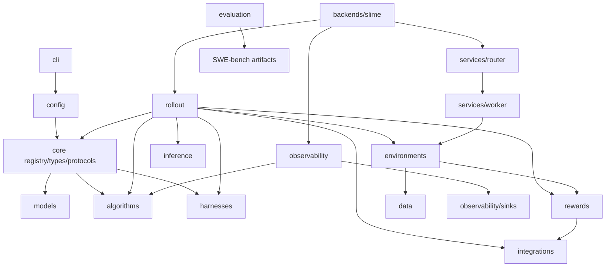

# LightRL 结构重构审查报告（2026-07-31）

## 范围与约束

仓库根目录 `/mnt/shared-storage-user/puyuan/code/LightRL` 即本文所称的
`lightrl/`；仓库内不存在第二层 `lightrl/` Python 包，主要可安装包是
`agentic_rl/`。

本轮只调整目录和私有模块组织，不改公开 `agentic_rl` 导出、`agentic-rl`
CLI、配置字段、注册表 target、训练参数或运行逻辑。未启动 Docker、rjob、
训练、推理或测试套件。

## 重构前目录树

以下为与本轮判断有关的源代码树；`slime/` 与 `Megatron-LM/` 是独立后端/
vendor 树，不纳入目录合并。

```text
LightRL/
├── agentic_rl/
│   ├── algorithms/{dapo,dive_po,grpo,lwm}/
│   ├── backends/slime/runtime/
│   ├── cli/
│   ├── config/
│   ├── core/
│   ├── data/
│   ├── environments/{agent_safetybench,agentharm,tau2,terminal}/
│   ├── evaluation/swebench/
│   ├── harnesses/{camel,claude_code,prm}/
│   ├── inference/
│   ├── integrations/clawsentry/
│   ├── models/
│   ├── observability/{rollout,sinks}/
│   ├── rewards/
│   ├── rollout/
│   │   ├── trajectory/
│   │   │   ├── policy.py
│   │   │   └── store.py
│   │   ├── admission.py
│   │   ├── entrypoint.py
│   │   ├── environment_factory.py
│   │   ├── runner.py
│   │   └── sample_builder.py
│   ├── runtime/
│   ├── services/{router,worker}/
│   └── worker_urls.example.txt
├── configs/{algorithm,backend,cluster,environment,experiment,harness,model,rollout,site}/
├── examples/
├── benchmarks/
├── tools/
├── deploy/
├── tests/
├── slime/
├── Megatron-LM/
└── docs/
```

## 职责、核心接口与依赖

| 路径 | 职责与核心文件 | 对外接口/入口 | 主要依赖 |
|---|---|---|---|
| `agentic_rl/cli` | 配置组合与命令派发；`main.py` | `agentic-rl`、`python -m agentic_rl.cli` | `config` |
| `agentic_rl/config` | YAML 组合、schema、校验、快照 | `compose_config`、`load_config` | `core.registry`、PyYAML |
| `agentic_rl/core` | 稳定类型、Protocol、延迟插件注册 | `REGISTRY`、`TaskSpec`、`RunContext` | Python 标准库 |
| `agentic_rl/models` | 模型族元数据和注册目标 | `MODEL_FAMILIES`、model profiles | `core.registry` 通过字符串加载 |
| `agentic_rl/algorithms` | GRPO/DAPO/DIVE-PO/LWM 扩展轴 | `ALGORITHMS`；DIVE-PO reward processor | `core`；DIVE-PO 被 rollout/observability 使用 |
| `agentic_rl/backends` | LightRL 到 Slime 的适配和启动脚本 | `backends/slime/runtime/train.sh` | `slime`、rollout、services、observability |
| `agentic_rl/harnesses` | Camel、Claude Code、PRM agent 适配 | `CamelAgent`、`ClaudeCodeAgent`、factory | `core.registry`、`inference` |
| `agentic_rl/inference` | SGLang turn client 与构造工厂 | `SGLangTurnClient`、factory | `core.types`、外部推理依赖 |
| `agentic_rl/environments` | 远端 client、terminal 生命周期和各 benchmark runtime | `TerminalEnvClient`、各 Env 类 | `core.types`、`rewards`、`data` |
| `agentic_rl/rewards` | 通用规则奖励与安全奖励 | reward helpers | `integrations.clawsentry` |
| `agentic_rl/rollout` | rollout 编排、采样、准入、环境选择、轨迹存储 | Slime custom generate/rollout entrypoint | core、harnesses、inference、environments、rewards、algorithms |
| `agentic_rl/observability` | rollout 指标聚合、格式化和 JSONL sink | `rollout_log`、`eval_rollout_log` | DIVE-PO rewards、sinks |
| `agentic_rl/services` | HTTP router 和 CPU worker pool 服务 | `python -m agentic_rl.services.{router,worker}.cli` | environments、core、FastAPI/aiohttp |
| `agentic_rl/runtime` | run ID 与运行目录/ckpt 路径 | `python -m agentic_rl.runtime.paths`、`RunPaths` | 标准库 |
| `agentic_rl/data` | 数据下载、转换、混合和加载工具 | 各 converter CLI/函数 | benchmark 数据格式 |
| `agentic_rl/evaluation` | SWE-bench 预测覆盖与官方格式报告 | `write_official_artifacts` | 标准库 |
| `agentic_rl/integrations` | 可选第三方边界 | `ClawSentryClient` | 外部服务 |
| `configs` | Harness × Model × Algorithm × Environment 组合配置 | `configs/experiment/*.yaml` | `config.loader` |
| `examples` | 稳定的人类可执行训练入口 | `examples/train_*.sh` | CLI、configs |
| `deploy` | CPU Docker worker 部署和恢复 | `run_pool_server_pu_v2.sh` 等 | Docker、services.worker |
| `tools` | 分析、评估、开发 smoke、rjob 手工入口 | 独立脚本 | 对应 package API |

公开包根接口保持为：

```python
from agentic_rl import REGISTRY, load_config
```

注册表中的 harness/model/algorithm target、Slime custom rollout log 路径和
所有 CLI 路径均未改变。

## 依赖关系图



依赖方向总体为“入口/编排 → 领域适配 → core”。唯一有意的跨领域依赖是安全
reward 到 ClawSentry integration，以及 rollout/observability 到 DIVE-PO 的
探索与奖励实现。

## 决策表

“影响的 import 数量”只统计仓库内需要修改的静态 import；文档引用另行说明。

| 当前路径 | 问题 | 操作 | 理由 | 影响的 import 数量 |
|---|---|---|---|---:|
| `rollout → trajectory → policy.py` | 仅含相邻 store 的私有 helper；imports/helpers 重复；拆分遗漏 `_get_terminal_save_dir` | 合并进 store，删除文件 | 同一生命周期和同一状态域，拆分没有独立接口 | 2 |
| `rollout → trajectory` 子目录 | 合并后只剩一个私有模块，无 package API、无注册入口 | 扁平化为 `rollout/trajectory_store.py` | 减少一层只有单文件的目录 | 3 |
| `agentic_rl → worker_urls.example.txt` | 非 Python 资源混入可安装包根 | 移至 `configs/site/` | 与 site-local 配置模板同类；运行默认路径仍是 `local/cluster/` | 0（文档 1） |
| `algorithms/{dapo,grpo,lwm}` | 当前文件少 | 保留 | 是注册表 target 和明确的算法扩展轴，未来扩展预期强 | 0 |
| `algorithms/dive_po/{exploration,rewards}` | 层级较深 | 保留 | 控制器/存储与 reward postprocess 职责不同，文件数量和复杂度足够 | 0 |
| `models/` | 仅 profiles + init | 保留 | Harness × Model × Algorithm 的稳定扩展轴，注册表直接引用 | 0 |
| `runtime/` | 单核心文件 | 保留 | 可独立 `python -m` 执行，负责运行身份/文件系统而非 config | 0 |
| `evaluation/swebench/` | 当前单实现 | 保留 | benchmark adapter 边界清晰，未来可并列其他 evaluator | 0 |
| `integrations/clawsentry/` | 当前单 integration | 保留 | 可选第三方依赖隔离边界，不能并入 rewards | 0 |
| `environments/{agent_safetybench,agentharm,tau2,terminal}` | 多个小目录 | 保留 | 各 benchmark 生命周期、依赖和协议不同 | 0 |
| `harnesses/{camel,claude_code,prm}` | PRM 当前较小 | 保留 | harness 是公开扩展轴；Claude Code 还有 gateway/MCP 边界 | 0 |
| `inference/factory.py` | factory 较薄 | 保留 | 隔离具体 SGLang client，为多后端扩展保留稳定入口 | 0 |
| `observability/{rollout,sinks}` | sinks 当前仅 JSONL | 保留 | 聚合与输出 sink 是不同扩展维度；合并会让 3k 行 entrypoint 更臃肿 | 0 |
| `services/http.py` | 单个共享 helper | 保留 | 同时被 router/worker 使用，放入任一子服务都会反向依赖 | 0 |
| `core/plugins.py` | 仅一个 helper，当前无内部调用 | 保留、待复核 | 非下划线函数可能被外部使用；删除无法在静态层面证明 API 安全 | 0 |
| `config/snapshot.py` | 单 helper，当前无内部调用 | 保留、待复核 | 快照属于独立 I/O 能力；外部调用风险不明确 | 0 |
| `data/` | 文件较多且扁平 | 保留现状 | converter 模块名已被工具/训练脚本直接 import；本轮强制分组收益小于兼容风险 | 0 |
| `slime/`、`Megatron-LM/` | 顶层大型目录 | 保留 | 独立维护/vendor 后端边界，不与 framework package 合并 | 0 |

## 重构后目录树

```text
LightRL/
├── agentic_rl/
│   ├── algorithms/{dapo,dive_po,grpo,lwm}/
│   ├── backends/slime/runtime/
│   ├── cli/
│   ├── config/
│   ├── core/
│   ├── data/
│   ├── environments/{agent_safetybench,agentharm,tau2,terminal}/
│   ├── evaluation/swebench/
│   ├── harnesses/{camel,claude_code,prm}/
│   ├── inference/
│   ├── integrations/clawsentry/
│   ├── models/
│   ├── observability/{rollout,sinks}/
│   ├── rewards/
│   ├── rollout/
│   │   ├── admission.py
│   │   ├── entrypoint.py
│   │   ├── environment_factory.py
│   │   ├── runner.py
│   │   ├── sample_builder.py
│   │   └── trajectory_store.py
│   ├── runtime/
│   └── services/{router,worker}/
├── configs/
│   └── site/
│       ├── example.yaml
│       └── worker_urls.example.txt
└── ...（其余顶层边界不变）
```

本地磁盘上可能仍看到已删除目录中的 `__pycache__/`；它们未被 Git 跟踪，
不属于重构后源代码树。

## 变更与提交

| Commit | 变更 |
|---|---|
| `20b8a0bf` | 将 trajectory policy 私有函数原样并回 store；删除重复模块 |
| `4f1b58b3` | 将 worker URL 示例移出可安装包，归入 site configs |
| `a71ba399` | 将只剩单文件的 private trajectory package 扁平化 |

迁移 policy 时对原文件与新 store 中的 18 个函数逐一比较 AST SHA-256，
全部一致；因此函数签名、默认值、分支和返回行为未发生变化。

## 静态验证结果

已执行且通过：

- `python3 -m compileall -q agentic_rl tests/agentic_rl tools`
- 对 `agentic_rl/`、`examples/`、`tools/`、`deploy/` 内所有跟踪的 `.sh`
  执行 `bash -n`
- 用 `yaml.safe_load` 解析全部 24 个 `configs/**/*.yaml`
- AST 扫描 139 个一方 Python 文件，107 个 `agentic_rl` 本地模块引用全部可解析
- `git diff --check`
- 精确扫描旧 policy/store 模块、旧 trajectory 子目录和包根 worker URL
  模板路径，结果均为零。

`ruff` 当前环境未安装；遵守“不引入新依赖”，未为本轮临时安装。

对所有 Git 跟踪 shell 的第一次宽扫描包含 vendor
`Megatron-LM/examples/academic_paper_scripts/`，其文档式
`<PATH_PLACEHOLDER>` 不是合法 Bash。按架构范围排除 vendor 后，一方脚本
全部通过。该 vendor 现象不是本轮引入的回归。

## 静态检查无法覆盖的路径

- `trajectory_store._save_rollout_artifacts` 的真实文件锁、目录创建、索引追加和
  清理行为。
- Slime 通过字符串加载 custom rollout/metric entrypoint 的运行时兼容性。
- SGLang/Ray/Megatron GPU 进程拓扑、NCCL 初始化和显存占用。
- CPU worker 的 Docker compose build/reset/evaluate/close 生命周期。
- 远端 worker URL、代理、镜像 registry、共享存储和 checkpoint 权限。
- DAPO 前若干 step 的 reward/loss/grad norm 数值趋势。

以上项目应按
[`manual_validation_20260731.md`](manual_validation_20260731.md)
由人工执行。

## 需人工复核的保守保留项

- `core/plugins.py`：当前内部未调用，但 `resolve_plugin` 是非私有名称；未删除。
- `config/snapshot.py`：当前内部未调用，但可能被外部运维脚本使用；未合并。
- `data/`：可进一步分成 converters/downloaders，但现有模块路径被 shell 和工具
  直接引用，建议在有 deprecation 周期时单独处理。
- `observability/rollout/entrypoint.py` 体积很大；它适合后续“拆分”，不适合本轮
  以减少目录为目标的“合并”。
- DAPO/GRPO/LWM 的空 extension package 看似冗余，实际是 registry target；
  在算法实现迁入前应保留。
